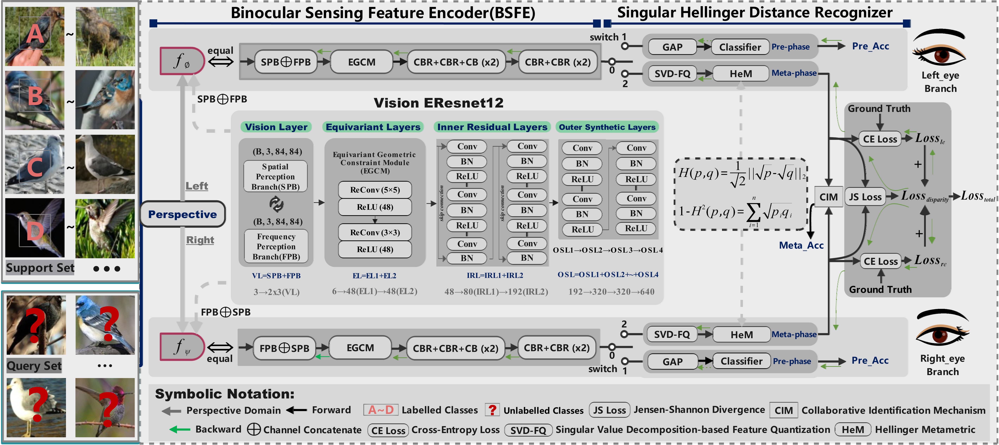

# BinoHeM: Binocular Singular Hellinger Metametric for Fine-Grained Few-Shot Classification


>This package includes our codes for implementing "BinoHeM: Binocular Singular Hellinger Metametric for Fine-Grained Few-Shot Classification". 
(First Release Date: 2024-5-28)

> Benchmark link: https://pan.baidu.com/s/1KNc0v-9vud0nmONA4-HR4A Code: cywr

>
# 1. Introduction
>*Meta-metric methods benefit from the advantages of concise principles but high efficiency, yet we also found that current meta-metric methods perform not ideal with the fine-grained scenarios.*
*Inspired by the specialty of our human binocular visual systems, this paper originally proposes a human-like metametric paradigm, the Binocular singular Hellinger Metametric (BinoHeM), with the superior symmetric binocular encoding and recognition mechanisms.
Specificaly, we have innovatively put forward two Binocular Sensing Feature Encoders(BSFEs), Singular Hellinger Metametric (HeM), and two Collaborative Identification Mechanisms(CIMs). 
On this basis, we further advance two excellent variants(BinoHeM-KDL,BinoHeM-MTL), adopting two different training mechanisms: knowledge distillation learning and meta-transfer learning.*
>
<p align="center"></p>

# 2. Pre-Training, Meta/KDL-Training, Meta/KDL-Evaluation for Our BinoHeM
```
##############################################
# 1.Pretraining for BinoHeM-MTL & BinoHeM-KDL.
##############################################
gpuid=3
dataset='stanford_car'
model='Vision_EResnet12'
method='BinoHeD'
vision_method='disparity' #['pure','disparity']
FLLS='shared'
AELS='shared'
DRS='SVD'     #['GCM','GRM','SVD']
CIM='WAS'     #['WAS', 'ARS']
check_resume='False'
check_epoch=0
# 预训练超参：
optim='SGD'   #['SGD','Adam']
pre_batch_size=32
pre_lr=0.05
pre_epoch=170
pre_num_episode=50
if [ $model != 'ResNet12' ]; then
    model_l='Le_'$model
    model_r='Re_'$model
else
    model_l=$model
    model_r=$model
fi
DATA_ROOT=/home/ssdData/qcfData/BinoHeD_benchmark/$dataset
cd ../

echo "============= pre-train ============="
python bino1_pretrain.py --CIM $CIM --FLLS $FLLS --AELS $AELS --DRS $DRS --batch_size $pre_batch_size --dataset $dataset --data_path $DATA_ROOT --model_l $model_l --model_r $model_r --method $method \
--vision_method $vision_method --check_resume $check_resume --check_epoch $check_epoch --optimizer $optim --image_size 84 --gpu ${gpuid} --pre_lr $pre_lr --wd 1e-4 \
--epoch $pre_epoch --milestones 100 150 --save_freq 100 --val meta --val_n_episode $pre_num_episode --n_shot 5
```

```
###############################################
# 2.Meta-training on 5way-1shot for BinoHeM-MTL
###############################################
gpuid=3
dataset='stanford_car'
model='Vision_EResnet12'
method='BinoHeD' 
vision_method='disparity'
FLLS='shared' 
AELS='shared' 
DRS='SVD'     #['GCM','GRM','SVD']
CIM='WAS'     #['WAS', 'ARS']
check_resume='False'
check_epoch=0
# 预训练超参：
pre_optim='SGD'   #['SGD','Adam']
pre_batch_size=32
pre_lr=0.05
pre_epoch=170
pre_num_episode=50
# 元训练超参：
optim='SGD'   #['SGD','Adam']
meta_lr=0.0001
meta_epoch=80
meta_train_episode=1000
meta_val_episode=600
if [ $model != 'ResNet12' ]; then
    model_l='Le_'$model
    model_r='Re_'$model
else
    model_l=$model
    model_r=$model
fi
if [ $FLLS = 'shared' ]; then
    FLLS_='share'
else
    FLLS_='split'
fi
if [ $AELS = 'shared' ]; then
    AELS_='share'
else
    AELS_='split'
fi
DATA_ROOT=/home/ssdData/qcfData/BinoHeD_benchmark/$dataset
MODEL_PATH=./checkpoints/$dataset/Bino_${model}_${method}_${vision_method}/FLLS_${FLLS_}_AELS_${AELS_}_DRS_${DRS}_CIM_${CIM}/prephase_${pre_optim}_${pre_batch_size}_${pre_lr}_${pre_num_episode}_${pre_epoch}/best_model.tar
cd ../

echo "============= meta-train 1-shot ============="
python bino2_metatrain.py --pre_batch_size $pre_batch_size --pre_epoch $pre_epoch --pre_num_episode $pre_num_episode --CIM $CIM --FLLS $FLLS --AELS $AELS --DRS $DRS --dataset $dataset --data_path $DATA_ROOT --model_l $model_l --model_r $model_r --method $method \
--pre_optimizer $pre_optim --vision_method $vision_method --check_resume $check_resume --check_epoch $check_epoch --optimizer $optim --image_size 84 --gpu ${gpuid} --pre_lr $pre_lr --meta_lr $meta_lr \
--epoch $meta_epoch --milestones 40 80 --n_shot 1 --train_n_episode $meta_train_episode --val_n_episode $meta_val_episode --pretrain_path $MODEL_PATH
```

```
###############################################
# 2.KDL-training on 5way-1shot for BinoHeM-KDL
###############################################
gpuid=3
dataset='stanford_car'
model='Vision_EResnet12'
method='BinoHeD'
vision_method='disparity'
FLLS='shared'
AELS='shared'
DRS='SVD'     #['GCM','GRM','SVD']
CIM='WAS'     #['WAS', 'ARS']
check_resume='False'
check_epoch=0
# 预训练超参：
pre_optim='SGD'  
pre_batch_size=32
pre_lr=0.05
pre_epoch=170
pre_num_episode=50
# 蒸馏超参：
kdl_optim='Adam'
kdl_epoch=170

if [ $model != 'ResNet12' ]; then
    model_l='Le_'$model
    model_r='Re_'$model
else
    model_l=$model
    model_r=$model
fi
if [ $FLLS = 'shared' ]; then
    FLLS_='share'
else
    FLLS_='split'
fi
if [ $AELS = 'shared' ]; then
    AELS_='share'
else
    AELS_='split'
fi
DATA_ROOT=/home/ssdData/qcfData/BinoHeD_benchmark/$dataset
cd ../

####################
# 知识蒸馏1
####################
echo "============= 5Way-1Shot ============="
MODEL_PATH=./checkpoints/$dataset/Bino_${model}_${method}_${vision_method}/FLLS_${FLLS_}_AELS_${AELS_}_DRS_${DRS}_CIM_${CIM}/prephase_${pre_optim}_${pre_batch_size}_${pre_lr}_${pre_num_episode}_${pre_epoch}/best_model.tar
python bino4_distilltrain.py --CIM $CIM --FLLS $FLLS --AELS $AELS --DRS $DRS --batch_size $pre_batch_size --dataset $dataset --data_path $DATA_ROOT --model_l $model_l --model_r $model_r --method $method \
--vision_method $vision_method --check_resume $check_resume --check_epoch $check_epoch --optimizer $kdl_optim --image_size 84 --gpu ${gpuid} --pre_lr $pre_lr --wd 1e-4 \
--epoch $kdl_epoch --milestones 100 150 --save_freq 100  --val_n_episode $pre_num_episode --n_shot 1  --val meta  --teacher_path $MODEL_PATH --trial 1 --val last \
--distill_lr 0.05
####################
# 知识蒸馏2
####################
echo "============= 5Way-1Shot ============="
teacher_path1=./checkpoints/$dataset/Bino_${model}_${method}_${vision_method}/FLLS_${FLLS_}_AELS_${AELS_}_DRS_${DRS}_CIM_${CIM}/distill_born1_${kdl_optim}_${pre_batch_size}_${pre_lr}_${pre_num_episode}_${kdl_epoch}_5way_1shot/distill_train/last_model.tar
python bino4_distilltrain.py --CIM $CIM --FLLS $FLLS --AELS $AELS --DRS $DRS --batch_size $pre_batch_size --dataset $dataset --data_path $DATA_ROOT --model_l $model_l --model_r $model_r --method $method \
--vision_method $vision_method --check_resume $check_resume --check_epoch $check_epoch --optimizer $kdl_optim --image_size 84 --gpu ${gpuid} --pre_lr $pre_lr --wd 1e-4 \
--epoch $kdl_epoch --milestones 100 150 --save_freq 100  --val_n_episode $pre_num_episode --n_shot 1  --val meta  --teacher_path $teacher_path1 --trial 2 --val last \
--distill_lr 0.05
```

```
#################################################
# 3.Meta-evaluation on 5way-1shot for BinoHeM-MTL
#################################################
gpuid=3
dataset='stanford_car'
model='Vision_EResnet12'
method='BinoHeD' 
vision_method='disparity'
FLLS='shared'
AELS='shared'
DRS='SVD' #['GCM','GRM','SVD']
CIM='WAS' #['WAS', 'ARS']
# 预训练超参：
pre_optim='SGD'
pre_batch_size=32
pre_lr=0.05
pre_epoch=170
pre_num_episode=50
# 元训练超参：
optim='SGD'
meta_lr=0.0001
meta_epoch=80
meta_train_episode=1000
meta_val_episode=600
if [ $model != 'ResNet12' ]; then
    model_l='Le_'$model
    model_r='Re_'$model
else
    model_l=$model
    model_r=$model
fi
if [ $FLLS = 'shared' ]; then
    FLLS_='share'
else
    FLLS_='split'
fi
if [ $AELS = 'shared' ]; then
    AELS_='share'
else
    AELS_='split'
fi
DATA_ROOT=/home/ssdData/qcfData/BinoHeD_benchmark/$dataset
MODEL_1SHOT_PATH=./checkpoints/$dataset/Bino_${model}_${method}_${vision_method}/FLLS_${FLLS_}_AELS_${AELS_}_DRS_${DRS}_CIM_${CIM}/metaphase_${pre_optim}_${pre_batch_size}_${pre_lr}_${pre_num_episode}_${pre_epoch}_5way_1shot/metatrain_${optim}_${meta_lr}_${meta_epoch}_train_${meta_train_episode}_val_${meta_val_episode}/best_model.tar
cd ../

echo "============= meta-test 1-shot ============="
N_SHOT=1
python bino3_metatest.py --pre_epoch $pre_epoch --pre_num_episode $pre_num_episode --meta_train_n_episode $meta_train_episode --meta_val_n_episode $meta_val_episode --meta_epoch $meta_epoch --pre_batch_size $pre_batch_size --CIM $CIM --FLLS $FLLS --AELS $AELS --DRS $DRS --pre_lr $pre_lr --meta_lr $meta_lr --dataset $dataset --data_path $DATA_ROOT --model_l $model_l --model_r $model_r --method $method \
--pre_optimizer $pre_optim --vision_method $vision_method --optimizer $optim --image_size 84 --gpu ${gpuid} --n_shot $N_SHOT --reduce_dim 640 --model_path $MODEL_1SHOT_PATH --test_task_nums 3 --test_n_episode 1000
```

```
#################################################
# 3.KDL-evaluation on 5way-1shot for BinoHeM-KDL
#################################################
gpuid=3
dataset='stanford_car'
model='Vision_EResnet12'
method='BinoHeD'
vision_method='disparity'
FLLS='shared'
AELS='shared'
DRS='SVD'    #['GCM','GRM','SVD']
CIM='WAS'    #['WAS', 'ARS']
# 预训练超参：
pre_optim='SGD'
pre_batch_size=32
pre_lr=0.05
pre_epoch=170
pre_num_episode=50
# 蒸馏超参：
kdl_optim='Adam'
kdl_epoch=170
times_test=3
num_episode=1000
if [ $model != 'ResNet12' ]; then
    model_l='Le_'$model
    model_r='Re_'$model
else
    model_l=$model
    model_r=$model
fi
if [ $FLLS = 'shared' ]; then
    FLLS_='share'
else
    FLLS_='split'
fi
if [ $AELS = 'shared' ]; then
    AELS_='share'
else
    AELS_='split'
fi
DATA_ROOT=/home/ssdData/qcfData/BinoHeD_benchmark/$dataset
MODEL11_PATH=./checkpoints/$dataset/Bino_${model}_${method}_${vision_method}/FLLS_${FLLS_}_AELS_${AELS_}_DRS_${DRS}_CIM_${CIM}/distill_born1_${kdl_optim}_${pre_batch_size}_${pre_lr}_${pre_num_episode}_${kdl_epoch}_5way_1shot/distill_train/last_model.tar
MODEL21_PATH=./checkpoints/$dataset/Bino_${model}_${method}_${vision_method}/FLLS_${FLLS_}_AELS_${AELS_}_DRS_${DRS}_CIM_${CIM}/distill_born2_${kdl_optim}_${pre_batch_size}_${pre_lr}_${pre_num_episode}_${kdl_epoch}_5way_1shot/distill_train/last_model.tar
cd ../

####################
# 知识蒸馏1
####################
trial=1
if [ "$trial" -eq 1 ]; then
    MODEL1_PATH=$MODEL11_PATH
    MODEL5_PATH=$MODEL15_PATH
elif [ "$trial" -eq 2 ]; then
    MODEL1_PATH=$MODEL21_PATH
    MODEL5_PATH=$MODEL25_PATH
else
    echo "Please set the trial!"
fi
echo "============= meta-test 1-shot ============="
N_SHOT=1
python bino5_distilltest.py --pre_epoch $pre_epoch --pre_num_episode $pre_num_episode --pre_batch_size $pre_batch_size --CIM $CIM --FLLS $FLLS --AELS $AELS --DRS $DRS --pre_lr $pre_lr --dataset $dataset --data_path $DATA_ROOT --model_l $model_l --model_r $model_r --method $method \
--pre_optimizer $pre_optim --vision_method $vision_method --optimizer $kdl_optim --image_size 84 --gpu ${gpuid} --n_shot $N_SHOT --reduce_dim 640 --model_path $MODEL1_PATH --trial $trial --test_task_nums $times_test --test_n_episode $num_episode

####################
# 知识蒸馏2
####################
trial=2
if [ "$trial" -eq 1 ]; then
    MODEL1_PATH=$MODEL11_PATH
    MODEL5_PATH=$MODEL15_PATH
elif [ "$trial" -eq 2 ]; then
    MODEL1_PATH=$MODEL21_PATH
    MODEL5_PATH=$MODEL25_PATH
else
    echo "Please set the trial!"
fi
echo "============= meta-test 1-shot ============="
N_SHOT=1
python bino5_distilltest.py --pre_epoch $pre_epoch --pre_num_episode $pre_num_episode --pre_batch_size $pre_batch_size --CIM $CIM --FLLS $FLLS --AELS $AELS --DRS $DRS --pre_lr $pre_lr --dataset $dataset --data_path $DATA_ROOT --model_l $model_l --model_r $model_r --method $method \
--pre_optimizer $pre_optim --vision_method $vision_method --optimizer $kdl_optim --image_size 84 --gpu ${gpuid} --n_shot $N_SHOT --reduce_dim 640 --model_path $MODEL1_PATH --trial $trial --test_task_nums $times_test --test_n_episode $num_episode
```


# 3. Exp1: Typical Fine-Grained Few-shot Classification(5way-1shot, -5shot)
*We report the Experimental results (Vision-EResnet12) on CUB-200-2011, Aircraft-fewshot, VGG-Flowers and StanfordCars benchmarks. We conducted three times 1,000 randomly sampled episodes experiments, and report average results for both 1-shot and 5-shot evaluation. More details on the experiments can be seen in the paper.*

### Ⅰ. CUB-200-2011
<table>
         <tr>
             <th rowspan="2" style="text-align:center;">Method(Ours)</th>
             <th colspan="2" style="text-align:center;">Vision-EResnet12</th>
             <th colspan="2" style="text-align:center;">Pre-trained Models</th>
             <th colspan="2" style="text-align:center;">Meta/KDL-trained Models</th>
             <th colspan="2" style="text-align:center;">Model Evaluation Notes</th>
         </tr>
         <tr>
             <th colspan="1" style="text-align:center;">5-way-1-shot</th>
             <th colspan="1" style="text-align:center;">5-way-5-shot</th>
             <th colspan="1" style="text-align:center;">Case-Model</th>
             <th colspan="1" style="text-align:center;">Lab-Note-Taking</th>
             <th colspan="1" style="text-align:center;">Case-Model(1shot)</th>
             <th colspan="1" style="text-align:center;">Lab-Note-Taking</th>
             <th colspan="1" style="text-align:center;">5-way-1-shot</th>
             <th colspan="1" style="text-align:center;">5-way-5-shot</th>
         </tr>
         <tr>
             <td style="text-align:center">BinoHeM-KDL(ARS)</td>
             <td style="text-align:center;">85.49±0.56 </td>
             <td style="text-align:center;">94.46±0.27 </td>
             <td style="text-align:center;"><a href="https://drive.google.com/file/d/12dEqEWltEYliWGclUarN0mwN-kbfRHNE/view?usp=drive_link">Download</a></td>
             <td style="text-align:center;"><a href="https://drive.google.com/file/d/1G4Ghwb1tD5bHc-y22vg7oa2szBbULgEw/view?usp=drive_link">Download</a></td>
             <td style="text-align:center;"><a href="https://drive.google.com/file/d/1-e1JaCGAj5MDDBnAoje0myHwsVOVX41Y/view?usp=drive_link">Download</a></td>
             <td style="text-align:center;"><a href="https://drive.google.com/file/d/15whrx0HUw-nLAwXPYO63clUye4fsp1T3/view?usp=drive_link">Download</a></td>
             <td style="text-align:center;"><a href="https://drive.google.com/file/d/136zA1fJZa0yCU50l1Gqu1LtSZ2SBAEdl/view?usp=drive_link">Download</a></td>
             <td style="text-align:center;"><a href="https://drive.google.com/file/d/19IdjCJ4vwQSu4cig49j9erMTx33NlW_6/view?usp=drive_link">Download</a></td>
         </tr>
         <tr>
             <td style="text-align:center">BinoHeM-KDL(WAS)</td>
             <td style="text-align:center;">85.17±0.56 </td>
             <td style="text-align:center;">94.31±0.29 </td>
             <td style="text-align:center;"><a href="https://drive.google.com/file/d/11zyGD1D3WnnFcDcnZWbVprbtD4GL3HcM/view?usp=drive_link">Download</a></td>
             <td style="text-align:center;"><a href="https://drive.google.com/file/d/1rD56TH4Ijwwqdx-XrucJwr55Xye1MBaD/view?usp=drive_link">Download</a></td>
             <td style="text-align:center;"><a href="https://drive.google.com/file/d/1L8Ndb1bw8VdMbsAc4Ckei5ot70-fB_48/view?usp=drive_link">Download</a></td>
             <td style="text-align:center;"><a href="https://drive.google.com/file/d/1LE_eiA1Jc3Feow2nIJyI_UiF-Who-z1t/view?usp=drive_link">Download</a></td>
             <td style="text-align:center;"><a href="https://drive.google.com/file/d/1SwyI7avCwyn4oPDbVvgCjlJmZwPJ3-U9/view?usp=drive_link">Download</a></td>
             <td style="text-align:center;"><a href="https://drive.google.com/file/d/1DhCKhWsfL8duMpLOwZqiIa4xpgRSF2NE/view?usp=drive_link">Download</a></td>
         </tr>
         <tr>
             <td style="text-align:center">BinoHeM-MTL(ARS)</td>
             <td style="text-align:center;">86.71±0.55 </td>
             <td style="text-align:center;">94.45±0.28 </td>
             <td style="text-align:center;"><a href="https://drive.google.com/file/d/1UMIPJMOxun9LtDFYUym6f0lnYEHDioof/view?usp=drive_link">Download</a></td>
             <td style="text-align:center;"><a href="https://drive.google.com/file/d/1umlN3RM2amJe3DYzjc-CtDBfBJOscnoa/view?usp=drive_link">Download</a></td>
             <td style="text-align:center;"><a href="https://drive.google.com/file/d/1rAEV0Qw514ym7qtgaTWsayM5DL2dY8Lq/view?usp=drive_link">Download</a></td>
             <td style="text-align:center;"><a href="https://drive.google.com/file/d/1JGUPLhG_GKH-0hw07SRbP0VxhXSHwTan/view?usp=drive_link">Download</a></td>
             <td style="text-align:center;"><a href="https://drive.google.com/file/d/1Lm_143KhRPkG7CZdaVI2aM1lxMw2IoLy/view?usp=drive_link">Download</a></td>
             <td style="text-align:center;"><a href="https://drive.google.com/file/d/1fPSc0tEODsOacAXXyPvCoM72HMtForeq/view?usp=drive_link">Download</a></td>
         </tr>
         <tr>
             <td style="text-align:center">BinoHeM-MTL(WAS)</td>
             <td style="text-align:center;">87.00±0.54 </td>
             <td style="text-align:center;">94.52±0.27 </td>
             <td style="text-align:center;"><a href="https://drive.google.com/file/d/1plmQac5pw_sGX6_wFG0IkbGjjHhqaUkX/view?usp=drive_link">Download</a></td>
             <td style="text-align:center;"><a href="https://drive.google.com/file/d/11iwBKYO_US5IGm7AFjyAV-vTv-RU2Ln5/view?usp=drive_link">Download</a></td>
             <td style="text-align:center;"><a href="https://drive.google.com/file/d/11mBLVj4_-Y7OAqzssMbmLVJTxB_8PTBX/view?usp=drive_link">Download</a></td>
             <td style="text-align:center;"><a href="https://drive.google.com/file/d/1FXXkhvt4nF0uGJIbvIKnzp7vcyM3Ax5S/view?usp=drive_link">Download</a></td>
             <td style="text-align:center;"><a href="https://drive.google.com/file/d/1mhPNRHhKQBvfevvWUsm5LPYYdWUlLYcL/view?usp=drive_link">Download</a></td>
             <td style="text-align:center;"><a href="https://drive.google.com/file/d/14Is1aTzErJ8Y84fhnfGqdbuMxARS-awz/view?usp=drive_link">Download</a></td>
         </tr>
</table>

*Note that for BinoHeM-MTL and BinoHeM-KDL, we used to obtain the same pre-trained models; and make experiments based on two CIMs for better results.*

### Ⅱ. Aircraft-fewshot
<table>
         <tr>
             <th rowspan="2" style="text-align:center;">Method(Ours)</th>
             <th colspan="2" style="text-align:center;">Vision-EResnet12</th>
             <th colspan="2" style="text-align:center;">Pre-trained Models</th>
             <th colspan="2" style="text-align:center;">Meta/KDL-trained Models</th>
             <th colspan="2" style="text-align:center;">Model Evaluation Notes</th>
         </tr>
         <tr>
             <th colspan="1" style="text-align:center;">5-way-1-shot</th>
             <th colspan="1" style="text-align:center;">5-way-5-shot</th>
             <th colspan="1" style="text-align:center;">Case-Model</th>
             <th colspan="1" style="text-align:center;">Lab-Note-Taking</th>
             <th colspan="1" style="text-align:center;">Case-Model(1shot)</th>
             <th colspan="1" style="text-align:center;">Lab-Note-Taking</th>
             <th colspan="1" style="text-align:center;">5-way-1-shot</th>
             <th colspan="1" style="text-align:center;">5-way-5-shot</th>
         </tr>
         <tr>
             <td style="text-align:center">BinoHeM-KDL(ARS)</td>
             <td style="text-align:center;">89.98±0.46 </td>
             <td style="text-align:center;">95.32±0.20 </td>
             <td style="text-align:center;"><a href="https://drive.google.com/file/d/1hnB-6Z7xtaG0ez-xjkomZfDxtfQpjiI4/view?usp=drive_link">Download</a></td>
             <td style="text-align:center;"><a href="https://drive.google.com/file/d/1rFJOuliaUYcwuaXUiqzW28lJHBTWMozy/view?usp=drive_link">Download</a></td>
             <td style="text-align:center;"><a href="https://drive.google.com/file/d/1Ovj2jpa9mPH6CyGhA9riibHdPp0rRpBk/view?usp=drive_link">Download</a></td>
             <td style="text-align:center;"><a href="https://drive.google.com/file/d/1nMjQ0HAl18UFFZP0Ynvnhw2RHfRhBu6h/view?usp=drive_link">Download</a></td>
             <td style="text-align:center;"><a href="https://drive.google.com/file/d/198FsPClvvqUTbXeJLub90Mff-btiwwkX/view?usp=drive_link">Download</a></td>
             <td style="text-align:center;"><a href="https://drive.google.com/file/d/1e_emisoeGSkOQZMEqQqfTODMMj_ae4Ay/view?usp=drive_link">Download</a></td>
         </tr>
         <tr>
             <td style="text-align:center">BinoHeM-KDL(WAS)</td>
             <td style="text-align:center;">90.10±0.48 </td>
             <td style="text-align:center;">95.29±0.20 </td>
             <td style="text-align:center;"><a href="https://drive.google.com/file/d/1GBhdc3pOrk8lq0mwDd0VSk5vbSVNr1AS/view?usp=drive_link">Download</a></td>
             <td style="text-align:center;"><a href="https://drive.google.com/file/d/1y94kwqBC_qQFiVEQpa408G2PqzeUwbjf/view?usp=drive_link">Download</a></td>
             <td style="text-align:center;"><a href="https://drive.google.com/file/d/1PuwpSehnNzR937vzNDT7t7mIGC0m8cyp/view?usp=drive_link">Download</a></td>
             <td style="text-align:center;"><a href="https://drive.google.com/file/d/1dpIhBIa-GtD4iOe2Q_Z_rvX0GB5FGkWu/view?usp=drive_link">Download</a></td>
             <td style="text-align:center;"><a href="https://drive.google.com/file/d/16tsFkd20ybb4aX27Yr_zZDKeJPL-GXSS/view?usp=drive_link">Download</a></td>
             <td style="text-align:center;"><a href="https://drive.google.com/file/d/1RSw0gRer7rUOC6-ycrg8I7INhFL66Wtv/view?usp=drive_link">Download</a></td>
         </tr>
         <tr>
             <td style="text-align:center">BinoHeM-MTL(ARS)</td>
             <td style="text-align:center;">90.57±0.48 </td>
             <td style="text-align:center;">95.25±0.20 </td>
             <td style="text-align:center;"><a href="https://drive.google.com/file/d/1pii6LNsdBZyDdBWxVXTAx_bsCobXb9MQ/view?usp=drive_link">Download</a></td>
             <td style="text-align:center;"><a href="https://drive.google.com/file/d/1QCDGku9hWsHgDJtCAlLrkTAwDzt-jS0y/view?usp=drive_link">Download</a></td>
             <td style="text-align:center;"><a href="https://drive.google.com/file/d/1sp2GPZWL8Z-V6dsnER5Cno-zWpLvuP8c/view?usp=drive_link">Download</a></td>
             <td style="text-align:center;"><a href="https://drive.google.com/file/d/1PhwL2S-OiaK1n4YshaKcabXgxRW-Bv1n/view?usp=drive_link">Download</a></td>
             <td style="text-align:center;"><a href="https://drive.google.com/file/d/1Fwu-vdY1e73HI7Rf9W1sRkkEHGWyCB9R/view?usp=drive_link">Download</a></td>
             <td style="text-align:center;"><a href="https://drive.google.com/file/d/1SDgdkDzXsEB7PLPJ0TIz7o2lBEFrDw1p/view?usp=drive_link">Download</a></td>
         </tr>
         <tr>
             <td style="text-align:center">BinoHeM-MTL(WAS)</td>
             <td style="text-align:center;">90.68±0.47 </td>
             <td style="text-align:center;">95.36±0.20 </td>
             <td style="text-align:center;"><a href="https://drive.google.com/file/d/1tyJ6PLBBw4DLltXLNYaacyu1Z_OvKOuh/view?usp=drive_link">Download</a></td>
             <td style="text-align:center;"><a href="https://drive.google.com/file/d/1nMKwsnRiVqPoz6cSeY0Q52wi8gf2dZJr/view?usp=drive_link">Download</a></td>
             <td style="text-align:center;"><a href="https://drive.google.com/file/d/1wRfmNDgm9UTIh9M7CUcwMEUsTu1xAn4R/view?usp=drive_link">Download</a></td>
             <td style="text-align:center;"><a href="https://drive.google.com/file/d/1Qi-8gcktyog2QoHZL-9E4s1dfZ6U1tIA/view?usp=drive_link">Download</a></td>
             <td style="text-align:center;"><a href="https://drive.google.com/file/d/1RESQslGWeANws4u-T05SsxEV5W8H7JFJ/view?usp=drive_link">Download</a></td>
             <td style="text-align:center;"><a href="https://drive.google.com/file/d/17I-hc_k3Xdd4cAgwptS55ixQCbUzmlXW/view?usp=drive_link">Download</a></td>
         </tr>
</table>

*Note that for BinoHeM-MTL and BinoHeM-KDL, we used to obtain the same pre-trained models; and make experiments based on two CIMs for better results.*

### Ⅲ. VGG-Flowers
<table>
         <tr>
             <th rowspan="2" style="text-align:center;">Method(Ours)</th>
             <th colspan="2" style="text-align:center;">Vision-EResnet12</th>
             <th colspan="2" style="text-align:center;">Pre-trained Models</th>
             <th colspan="2" style="text-align:center;">Meta/KDL-trained Models</th>
             <th colspan="2" style="text-align:center;">Model Evaluation Notes</th>
         </tr>
         <tr>
             <th colspan="1" style="text-align:center;">5-way-1-shot</th>
             <th colspan="1" style="text-align:center;">5-way-5-shot</th>
             <th colspan="1" style="text-align:center;">Case-Model</th>
             <th colspan="1" style="text-align:center;">Lab-Note-Taking</th>
             <th colspan="1" style="text-align:center;">Case-Model(1shot)</th>
             <th colspan="1" style="text-align:center;">Lab-Note-Taking</th>
             <th colspan="1" style="text-align:center;">5-way-1-shot</th>
             <th colspan="1" style="text-align:center;">5-way-5-shot</th>
         </tr>
         <tr>
             <td style="text-align:center">BinoHeM-KDL(ARS)</td>
             <td style="text-align:center;">81.82±0.56 </td>
             <td style="text-align:center;">93.28±0.28 </td>
             <td style="text-align:center;"><a href="https://drive.google.com/file/d/1cXpWYtFPVKZ1g9ss-lMerfxKqtN-LS31/view?usp=drive_link">Download</a></td>
             <td style="text-align:center;"><a href="https://drive.google.com/file/d/1dSAy2iL8Xlw-nPth5Ekn5CpRyZJatScf/view?usp=drive_link">Download</a></td>
             <td style="text-align:center;"><a href="https://drive.google.com/file/d/1VZsjagbqQUllBJFt2iyDubBubBS33aQq/view?usp=drive_link">Download</a></td>
             <td style="text-align:center;"><a href="https://drive.google.com/file/d/1HcGsrARqgovcKXgv_O2VQ9UzKzckxVCR/view?usp=drive_link">Download</a></td>
             <td style="text-align:center;"><a href="https://drive.google.com/file/d/1PRcotdKGadL4PE6xJaA9YU7WJTVR46Ha/view?usp=drive_link">Download</a></td>
             <td style="text-align:center;"><a href="https://drive.google.com/file/d/1K2Jr4Zi_eW0gdM4GW874QFQ9EYxChDAF/view?usp=drive_link">Download</a></td>
         </tr>
         <tr>
             <td style="text-align:center">BinoHeM-KDL(WAS)</td>
             <td style="text-align:center;">81.73±0.57 </td>
             <td style="text-align:center;">93.19±0.28 </td>
             <td style="text-align:center;"><a href="https://drive.google.com/file/d/1R3HPks1Hq42sTHFC6XTV0Zw5E9UzUgX2/view?usp=drive_link">Download</a></td>
             <td style="text-align:center;"><a href="https://drive.google.com/file/d/1sgS2RVEzyo0JkwGzVVSTBylbI2Z72apv/view?usp=drive_link">Download</a></td>
             <td style="text-align:center;"><a href="https://drive.google.com/file/d/1KfjtU14k0Z6QAeiHF9fhvN3KWl_Zu8Ns/view?usp=drive_link">Download</a></td>
             <td style="text-align:center;"><a href="https://drive.google.com/file/d/1ZXUsfVqdSN__9kELL4XJKG3vpImnLfrK/view?usp=drive_link">Download</a></td>
             <td style="text-align:center;"><a href="https://drive.google.com/file/d/10xHh-dVBkJb9jzZfdoH8hnj8uQEHFcVC/view?usp=drive_link">Download</a></td>
             <td style="text-align:center;"><a href="https://drive.google.com/file/d/1JSiCwAMg0nwN4sjMScdO5qpR1PwR4Cxv/view?usp=drive_link">Download</a></td>
         </tr>
         <tr>
             <td style="text-align:center">BinoHeM-MTL(ARS)</td>
             <td style="text-align:center;">82.04±0.59 </td>
             <td style="text-align:center;">93.87±0.26 </td>
             <td style="text-align:center;"><a href="https://drive.google.com/file/d/1jmuMXcPGfD4fuOD_BkvXyH_KC7NQZnkO/view?usp=drive_link">Download</a></td>
             <td style="text-align:center;"><a href="https://drive.google.com/file/d/1V-J7WxMSU4X22ikK0KqkbBa6fVp0N8WK/view?usp=drive_link">Download</a></td>
             <td style="text-align:center;"><a href="https://drive.google.com/file/d/10cpRxvv-Lb6NgcIbsGYKUs16mF4UqPMY/view?usp=drive_link">Download</a></td>
             <td style="text-align:center;"><a href="https://drive.google.com/file/d/1jFiw5MNffLHX70UcNRBt1hsPfKTzeknz/view?usp=drive_link">Download</a></td>
             <td style="text-align:center;"><a href="https://drive.google.com/file/d/1gcEGjyxr_9n00l-ePn1_nA4aYoaUt2mN/view?usp=drive_link">Download</a></td>
             <td style="text-align:center;"><a href="https://drive.google.com/file/d/15y-NdtXQK2uVr1TmcU-ESEicricxv3j8/view?usp=drive_link">Download</a></td>
         </tr>
         <tr>
             <td style="text-align:center">BinoHeM-MTL(WAS)</td>
             <td style="text-align:center;">82.31±0.57 </td>
             <td style="text-align:center;">93.88±0.26 </td>
             <td style="text-align:center;"><a href="https://drive.google.com/file/d/1Of0WJt2X2b4kuOsJl-Xo7iX88pThdMHr/view?usp=drive_link">Download</a></td>
             <td style="text-align:center;"><a href="https://drive.google.com/file/d/162wCsomN3mkhyBUn_zRKaOl__hask-fz/view?usp=drive_link">Download</a></td>
             <td style="text-align:center;"><a href="https://drive.google.com/file/d/1ImPNyNLO4vJlgEUxKsuOn5ZsEKBD5Eou/view?usp=drive_link">Download</a></td>
             <td style="text-align:center;"><a href="https://drive.google.com/file/d/17CCgJhzLpGznBxvNiPSRWVa2CcFB6iPB/view?usp=drive_link">Download</a></td>
             <td style="text-align:center;"><a href="https://drive.google.com/file/d/14_TTYj3v3GHT2fgi5QLlnRX8sTwbxQsJ/view?usp=drive_link">Download</a></td>
             <td style="text-align:center;"><a href="https://drive.google.com/file/d/1_O1ObM6wzFvH6CUteG413uljglFDyGLa/view?usp=drive_link">Download</a></td>
         </tr>
</table>

*Note that for BinoHeM-MTL and BinoHeM-KDL, we used to obtain the same pre-trained models; and make experiments based on two CIMs for better results.*

### Ⅳ. Stanford-Cars
<table>
         <tr>
             <th rowspan="2" style="text-align:center;">Method(Ours)</th>
             <th colspan="2" style="text-align:center;">Vision-EResnet12</th>
             <th colspan="2" style="text-align:center;">Pre-trained Models</th>
             <th colspan="2" style="text-align:center;">Meta/KDL-trained Models</th>
             <th colspan="2" style="text-align:center;">Model Evaluation Notes</th>
         </tr>
         <tr>
             <th colspan="1" style="text-align:center;">5-way-1-shot</th>
             <th colspan="1" style="text-align:center;">5-way-5-shot</th>
             <th colspan="1" style="text-align:center;">Case-Model</th>
             <th colspan="1" style="text-align:center;">Lab-Note-Taking</th>
             <th colspan="1" style="text-align:center;">Case-Model(1shot)</th>
             <th colspan="1" style="text-align:center;">Lab-Note-Taking</th>
             <th colspan="1" style="text-align:center;">5-way-1-shot</th>
             <th colspan="1" style="text-align:center;">5-way-5-shot</th>
         </tr>
         <tr>
             <td style="text-align:center">BinoHeM-KDL(ARS)</td>
             <td style="text-align:center;">81.46±0.63 </td>
             <td style="text-align:center;">93.81±0.28 </td>
             <td style="text-align:center;"><a href="https://drive.google.com/file/d/1meXKAmoMP1Ds6SNoHVE3LT5E4NdYJtJA/view?usp=drive_link">Download</a></td>
             <td style="text-align:center;"><a href="https://drive.google.com/file/d/1YeYDgh2O0wV3oTUQTkpQgrmwTMCZI5JO/view?usp=drive_link">Download</a></td>
             <td style="text-align:center;"><a href="https://drive.google.com/file/d/1f1LOMfRP3NPkj1vsQbCc89cmVoFEoDNo/view?usp=drive_link">Download</a></td>
             <td style="text-align:center;"><a href="https://drive.google.com/file/d/1NX0qjz1OrB206t4Cs5hAsfQMD__zyXGn/view?usp=drive_link">Download</a></td>
             <td style="text-align:center;"><a href="https://drive.google.com/file/d/1N4C8ARg41MmiRj4W4jE-NI-CaRDecW0R/view?usp=drive_link">Download</a></td>
             <td style="text-align:center;"><a href="https://drive.google.com/file/d/1wOs27ecqx1PUEafN0vC4HuWRPAjf4wd3/view?usp=drive_link">Download</a></td>
         </tr>
         <tr>
             <td style="text-align:center">BinoHeM-KDL(WAS)</td>
             <td style="text-align:center;">81.08±0.63 </td>
             <td style="text-align:center;">93.84±0.28 </td>
             <td style="text-align:center;"><a href="https://drive.google.com/file/d/1xrzxysh6ShtdP6XTfEmXHqGkgRc9hZTb/view?usp=drive_link">Download</a></td>
             <td style="text-align:center;"><a href="https://drive.google.com/file/d/1qrkpEElzrlM5W6VbClzP1AWNbKFCwgpF/view?usp=drive_link">Download</a></td>
             <td style="text-align:center;"><a href="https://drive.google.com/file/d/1reYQjR--fvjp5iNt_TWjG8g17oEchfi2/view?usp=drive_link">Download</a></td>
             <td style="text-align:center;"><a href="https://drive.google.com/file/d/1VWAufIVCGhfBwhx0PJ52zK-IE3MwcT2s/view?usp=drive_link">Download</a></td>
             <td style="text-align:center;"><a href="https://drive.google.com/file/d/1tet9PxYO3Go7fc3KtwFGwmERURg4Tm6-/view?usp=drive_link">Download</a></td>
             <td style="text-align:center;"><a href="https://drive.google.com/file/d/1mD8AQc088aFjGA2ZIKjEX3bmN4vBBHdm/view?usp=drive_link">Download</a></td>
         </tr>
         <tr>
             <td style="text-align:center">BinoHeM-MTL(ARS)</td>
             <td style="text-align:center;">85.09±0.56 </td>
             <td style="text-align:center;">94.32±0.26 </td>
             <td style="text-align:center;"><a href="https://drive.google.com/file/d/1HgSMHif9VzKkRp2RAWdDXjoTBsYH1Wo0/view?usp=drive_link">Download</a></td>
             <td style="text-align:center;"><a href="https://drive.google.com/file/d/1vNvwkcDD5fSKXWfhYO3uNc7xp-xXmDv1/view?usp=drive_link">Download</a></td>
             <td style="text-align:center;"><a href="https://drive.google.com/file/d/1dB0Ph1-wlR81oO6I6sfuun0L8Lf_dFmL/view?usp=drive_link">Download</a></td>
             <td style="text-align:center;"><a href="https://drive.google.com/file/d/15IFKwTjj4hIUjDXGCWhJ0lSh43tSS5KD/view?usp=drive_link">Download</a></td>
             <td style="text-align:center;"><a href="https://drive.google.com/file/d/1zgO0tOP7UFjYUR7Y4yGIrxQsbWoG2zR3/view?usp=drive_link">Download</a></td>
             <td style="text-align:center;"><a href="https://drive.google.com/file/d/1thnqELLMr47hiUdEoic0cL5ZhpmLVqu1/view?usp=drive_link">Download</a></td>
         </tr>
         <tr>
             <td style="text-align:center">BinoHeM-MTL(WAS)</td>
             <td style="text-align:center;">84.90±0.57 </td>
             <td style="text-align:center;">94.36±0.26 </td>
             <td style="text-align:center;"><a href="https://drive.google.com/file/d/13xC4-vmJLguQ0o4zXiGLLu_Gze6JNJap/view?usp=drive_link">Download</a></td>
             <td style="text-align:center;"><a href="https://drive.google.com/file/d/1MzUSTWATPECMlOubtKSsdW_mrlgntCLk/view?usp=drive_link">Download</a></td>
             <td style="text-align:center;"><a href="https://drive.google.com/file/d/14aH4Rm2WDUF2QOTW9e4Wt6x04k6puF-p/view?usp=drive_link">Download</a></td>
             <td style="text-align:center;"><a href="https://drive.google.com/file/d/1-3-Hb0Bxb0Qx4cOuc_MdrQvBLEyffgXF/view?usp=drive_link">Download</a></td>
             <td style="text-align:center;"><a href="https://drive.google.com/file/d/1BD1DJjUYqPc5ctlHJI5VW7nDusGiVqUu/view?usp=drive_link">Download</a></td>
             <td style="text-align:center;"><a href="https://drive.google.com/file/d/1ktsdiezyFOlkm0-waCq6h0hSQV8kajSq/view?usp=drive_link">Download</a></td>
         </tr>
</table>

*Note that for BinoHeM-MTL and BinoHeM-KDL, we used to obtain the same pre-trained models; and make experiments based on two CIMs for better results.*


# 4. Exp2: Generalized Fine-Grained Few-shot Classification(multi-way,multi-shot)
*We report the Experimental results on StanfordCars benchmark. We conducted three times 1,000 randomly sampled episodes experiments, and report average results for both Multi-way(5-10) and Multi-shot(1,5,10,15,20,25) evaluation. More details on the experiments can be seen in the paper.*
<table>
         <tr>
             <th rowspan="2" style="text-align:center;">Method(Ours)</th>
             <th colspan="3" style="text-align:center;">5way-1shot</th>
             <th colspan="3" style="text-align:center;">6way-1shot</th>
             <th colspan="3" style="text-align:center;">7way-1shot</th>
             <th colspan="3" style="text-align:center;">8way-1shot</th>
         </tr>
         <tr>
             <th colspan="1" style="text-align:center;">ACC.(%)</th>
             <th colspan="1" style="text-align:center;">Pre-train</th>
             <th colspan="1" style="text-align:center;">Meta-train</th>
             <th colspan="1" style="text-align:center;">ACC.(%)</th>
             <th colspan="1" style="text-align:center;">Pre-train</th>
             <th colspan="1" style="text-align:center;">Meta-train</th>
             <th colspan="1" style="text-align:center;">ACC.(%)</th>
             <th colspan="1" style="text-align:center;">Pre-train</th>
             <th colspan="1" style="text-align:center;">Meta-train</th>
             <th colspan="1" style="text-align:center;">ACC.(%)</th>
             <th colspan="1" style="text-align:center;">Pre-train</th>
             <th colspan="1" style="text-align:center;">Meta-train</th>
         </tr>
         <tr>
             <td style="text-align:center">Protonet</td>
             <td style="text-align:center;">78.25 <a href="https://drive.google.com/file/d/1I9i2aN71eh_N1Z5OLJAjS6402eW1e0km/view?usp=drive_link"> [Note]</a></a></td>
             <td style="text-align:center;"><a href="https://drive.google.com/file/d/1j3KIxRGVWP1eSOrtCeO1J1iS7xEOffHZ/view?usp=drive_link"> Model</a> <a href="https://drive.google.com/file/d/1Bcw6fYHXW2EmGVkf0Wmr18dKLEx5FXqx/view?usp=drive_link"> [Note]</a></td>
             <td style="text-align:center;"><a href="https://drive.google.com/file/d/1kotoeFv7ZnK_CSwEtLyJlvb8MWDXRiDe/view?usp=drive_link"> Model</a> <a href="https://drive.google.com/file/d/12XLmqf7F0AUdyfpZQCEDwwS9xhJHEC-I/view?usp=drive_link"> [Note]</a></td>
             <td style="text-align:center;">75.55 <a href="https://drive.google.com/file/d/1C5Qm_u2-RBvs2w0t33qQLR2v4Uh3QTn4/view?usp=drive_link"> [Note]</a></a></td>
             <td style="text-align:center;"><a href="https://drive.google.com/file/d/1j3KIxRGVWP1eSOrtCeO1J1iS7xEOffHZ/view?usp=drive_link"> Model</a> <a href="https://drive.google.com/file/d/1Bcw6fYHXW2EmGVkf0Wmr18dKLEx5FXqx/view?usp=drive_link"> [Note]</a></td>
             <td style="text-align:center;"><a href="https://drive.google.com/file/d/1xFb1dmuqehLFXaRitQt9Tfjk8hVMii0d/view?usp=drive_link"> Model</a> <a href="https://drive.google.com/file/d/1AU1P77-1LASYYDOVzAybyigdX_YxjGCn/view?usp=drive_link"> [Note]</a></td>
             <td style="text-align:center;">73.19 <a href="https://drive.google.com/file/d/1ATJIqGg7jYJap55ZQQ0LnQlnXyzR2sWW/view?usp=drive_link"> [Note]</a></a></td>
             <td style="text-align:center;"><a href="https://drive.google.com/file/d/1j3KIxRGVWP1eSOrtCeO1J1iS7xEOffHZ/view?usp=drive_link"> Model</a> <a href="https://drive.google.com/file/d/1Bcw6fYHXW2EmGVkf0Wmr18dKLEx5FXqx/view?usp=drive_link"> [Note]</a></td>
             <td style="text-align:center;"><a href="https://drive.google.com/file/d/1CoH9yA56B3WYbqaC6-SzOfUeUx07ebs3/view?usp=drive_link"> Model</a> <a href="https://drive.google.com/file/d/1KJD89UnQTAQzcj0lPtT32UOC6dNBq60a/view?usp=drive_link"> [Note]</a></td>
             <td style="text-align:center;">70.78 <a href="https://drive.google.com/file/d/1gNYcR19_Lv6YZzUlB6PCoSv-bzLO36ll/view?usp=drive_link"> [Note]</a></a></td>
             <td style="text-align:center;"><a href="https://drive.google.com/file/d/1j3KIxRGVWP1eSOrtCeO1J1iS7xEOffHZ/view?usp=drive_link"> Model</a> <a href="https://drive.google.com/file/d/1Bcw6fYHXW2EmGVkf0Wmr18dKLEx5FXqx/view?usp=drive_link"> [Note]</a></td>
             <td style="text-align:center;"><a href="https://drive.google.com/file/d/1rWE9J8TxhANTCoev6eEzX-Ynso9mmKV7/view?usp=drive_link"> Model</a> <a href="https://drive.google.com/file/d/12vpVuZX2k4lp_kd2xEhucPG7UcuwjJKc/view?usp=drive_link"> [Note]</a></td>
         </tr>
         <tr>
             <td style="text-align:center">DeepBDC</td>
             <td style="text-align:center;">76.84 <a href="https://drive.google.com/file/d/1manAw1iMv0mdjpfpz0T9BuXhu08LzvOt/view?usp=drive_link"> [Note]</a></a></td>
             <td style="text-align:center;"><a href="https://drive.google.com/file/d/1RpoBjnYuQMVjEDzHqGInm0jWHK2kqXCU/view?usp=drive_link"> Model</a> <a href="https://drive.google.com/file/d/1S0BeMlgQGOZ_cVmXuwLzuerPh2CPv7C7/view?usp=drive_link"> [Note]</a></td>
             <td style="text-align:center;"><a href="https://drive.google.com/file/d/1aeZtFvUHI4LYdatC1tmARCLKX1t54HTs/view?usp=drive_link"> Model</a> <a href="https://drive.google.com/file/d/1Zcr_B1CYiX0z0sSXojyIQmgqQl-IvSZM/view?usp=drive_link"> [Note]</a></td>
             <td style="text-align:center;">74.61 <a href="https://drive.google.com/file/d/1UV9w3jkoCqaYzFrm0ObIXplM5WN6KNxZ/view?usp=drive_link"> [Note]</a></a></td>
             <td style="text-align:center;"><a href="https://drive.google.com/file/d/1RpoBjnYuQMVjEDzHqGInm0jWHK2kqXCU/view?usp=drive_link"> Model</a> <a href="https://drive.google.com/file/d/1S0BeMlgQGOZ_cVmXuwLzuerPh2CPv7C7/view?usp=drive_link"> [Note]</a></td>
             <td style="text-align:center;"><a href="https://drive.google.com/file/d/152Gk2iRsE7w1B9qZRjRhRbYkpsgOhRMl/view?usp=drive_link"> Model</a> <a href="https://drive.google.com/file/d/1xTLOpWyiJmCNfV5plrxU3HbFvheQROMq/view?usp=drive_link"> [Note]</a></td>
             <td style="text-align:center;">72.44 <a href="https://drive.google.com/file/d/1G4G7wzvmNKafIqIKcVG00FvtFlbi8c6F/view?usp=drive_link"> [Note]</a></a></td>
             <td style="text-align:center;"><a href="https://drive.google.com/file/d/1RpoBjnYuQMVjEDzHqGInm0jWHK2kqXCU/view?usp=drive_link"> Model</a> <a href="https://drive.google.com/file/d/1S0BeMlgQGOZ_cVmXuwLzuerPh2CPv7C7/view?usp=drive_link"> [Note]</a></td>
             <td style="text-align:center;"><a href="https://drive.google.com/file/d/16qFpBKELTsga6cZWbhspbgG8W8UbqgtH/view?usp=drive_link"> Model</a> <a href="https://drive.google.com/file/d/1UcBHi6NwImgXrGrAVRliBcrwseKnkpTR/view?usp=drive_link"> [Note]</a></td>
             <td style="text-align:center;">70.68 <a href="https://drive.google.com/file/d/1PXCjGwVMmRCDsLYgu9w7-VY71B8cTyUT/view?usp=drive_link"> [Note]</a></a></td>
             <td style="text-align:center;"><a href="https://drive.google.com/file/d/1RpoBjnYuQMVjEDzHqGInm0jWHK2kqXCU/view?usp=drive_link"> Model</a> <a href="https://drive.google.com/file/d/1S0BeMlgQGOZ_cVmXuwLzuerPh2CPv7C7/view?usp=drive_link"> [Note]</a></td>
             <td style="text-align:center;"><a href="https://drive.google.com/file/d/19JrdvVDoxo09JiiZizeh1tpCu1Gl8GKg/view?usp=drive_link"> Model</a> <a href="https://drive.google.com/file/d/1GRlYa_9AC4zSp1rlc7G-rxAuS2nodDCl/view?usp=drive_link"> [Note]</a></td>
         </tr>
         <tr>
             <td style="text-align:center">BinoHeM(Ours)</td>
             <td style="text-align:center;">84.90 <a href="https://drive.google.com/file/d/1-XvYd9h2wm10oxxCmvgskzMMEyah9_wc/view?usp=drive_link"> [Note]</a></a></td>
             <td style="text-align:center;"><a href="https://drive.google.com/file/d/1TRhJonFfGnkpix02UaHKqhCVpcw6r0g_/view?usp=drive_link"> Model</a> <a href="https://drive.google.com/file/d/1Ca1e8G80dr5ILPZTPsrvGV8FK931C8o9/view?usp=drive_link"> [Note]</a></td>
             <td style="text-align:center;"><a href="https://drive.google.com/file/d/10d7cI_w1Q4CJ9Rc5-i1Pb3XeNZ3daW9U/view?usp=drive_link"> Model</a> <a href="https://drive.google.com/file/d/1-5oKeuW_HlrSorLzmCj7dhi3ftxY-Wd0/view?usp=drive_link"> [Note]</a></td>
             <td style="text-align:center;">82.77 <a href="https://drive.google.com/file/d/1hi5wIu8yHvMg7pjUlluff0K2kbqABHSK/view?usp=drive_link"> [Note]</a></a></td>
             <td style="text-align:center;"><a href="https://drive.google.com/file/d/1TRhJonFfGnkpix02UaHKqhCVpcw6r0g_/view?usp=drive_link"> Model</a> <a href="https://drive.google.com/file/d/1Ca1e8G80dr5ILPZTPsrvGV8FK931C8o9/view?usp=drive_link"> [Note]</a></td>
             <td style="text-align:center;"><a href="https://drive.google.com/file/d/1-SFEMdfnBQ0stC14w-DGEG_e7Fb6mxVo/view?usp=drive_link"> Model</a> <a href="https://drive.google.com/file/d/1f5ou6T83hglA4zf2E8B1u7-GcEvcGs8k/view?usp=drive_link"> [Note]</a></td>
             <td style="text-align:center;">80.90 <a href="https://drive.google.com/file/d/1J0a7PbpSVX9rv77hhAzyPntE4qU2LvnV/view?usp=drive_link"> [Note]</a></a></td>
             <td style="text-align:center;"><a href="https://drive.google.com/file/d/1TRhJonFfGnkpix02UaHKqhCVpcw6r0g_/view?usp=drive_link"> Model</a> <a href="https://drive.google.com/file/d/1Ca1e8G80dr5ILPZTPsrvGV8FK931C8o9/view?usp=drive_link"> [Note]</a></td>
             <td style="text-align:center;"><a href="https://drive.google.com/file/d/1g07wfrO8te3l-zKEkd0ABCTnbT5c8Lhd/view?usp=drive_link"> Model</a> <a href="https://drive.google.com/file/d/1OLmzwkbwUdbK4iAKONKe1ft4X6QGNnqe/view?usp=drive_link"> [Note]</a></td>
             <td style="text-align:center;">79.19 <a href="https://drive.google.com/file/d/1msFbvDkbcLd3xqqwDS3FKbT_LgmYT9c4/view?usp=drive_link"> [Note]</a></a></td>
             <td style="text-align:center;"><a href="https://drive.google.com/file/d/1TRhJonFfGnkpix02UaHKqhCVpcw6r0g_/view?usp=drive_link"> Model</a> <a href="https://drive.google.com/file/d/1Ca1e8G80dr5ILPZTPsrvGV8FK931C8o9/view?usp=drive_link"> [Note]</a></td>
             <td style="text-align:center;"><a href="https://drive.google.com/file/d/1STj-Qx-nI7tzaBA8fEYJ9f5126axO5bS/view?usp=drive_link"> Model</a> <a href="https://drive.google.com/file/d/1dShxMQA1EBByir2IEWluZfICilHH8g24/view?usp=drive_link"> [Note]</a></td>
         </tr>
</table>

<table>
         <tr>
             <th rowspan="2" style="text-align:center;">Method(Ours)</th>
             <th colspan="3" style="text-align:center;">5way-5shot</th>
             <th colspan="3" style="text-align:center;">5way-10shot</th>
             <th colspan="3" style="text-align:center;">5way-15shot</th>
             <th colspan="3" style="text-align:center;">5way-20shot</th>
         </tr>
         <tr>
             <th colspan="1" style="text-align:center;">ACC.(%)</th>
             <th colspan="1" style="text-align:center;">Pre-train</th>
             <th colspan="1" style="text-align:center;">Meta-train</th>
             <th colspan="1" style="text-align:center;">ACC.(%)</th>
             <th colspan="1" style="text-align:center;">Pre-train</th>
             <th colspan="1" style="text-align:center;">Meta-train</th>
             <th colspan="1" style="text-align:center;">ACC.(%)</th>
             <th colspan="1" style="text-align:center;">Pre-train</th>
             <th colspan="1" style="text-align:center;">Meta-train</th>
             <th colspan="1" style="text-align:center;">ACC.(%)</th>
             <th colspan="1" style="text-align:center;">Pre-train</th>
             <th colspan="1" style="text-align:center;">Meta-train</th>
         </tr>
         <tr>
             <td style="text-align:center">Protonet</td>
             <td style="text-align:center;">89.74 <a href="https://drive.google.com/file/d/1vKnrBiAxBhA__jkSJF-58_3sxkc6S-ki/view?usp=drive_link"> [Note]</a></a></td>
             <td style="text-align:center;"><a href="https://drive.google.com/file/d/1j3KIxRGVWP1eSOrtCeO1J1iS7xEOffHZ/view?usp=drive_link"> Model</a> <a href="https://drive.google.com/file/d/1Bcw6fYHXW2EmGVkf0Wmr18dKLEx5FXqx/view?usp=drive_link"> [Note]</a></td>
             <td style="text-align:center;"><a href="https://drive.google.com/file/d/1-S7a4a9l-T5FGToTa0_fM_l3Gg160dpR/view?usp=drive_link"> Model</a> <a href="https://drive.google.com/file/d/10uZdr4TcXOcMohaxpEimffDymPP0P8PE/view?usp=drive_link"> [Note]</a></td>
             <td style="text-align:center;">91.61 <a href="https://drive.google.com/file/d/1tBzyfllnBU1veyeKkBM85rdA2Ow3HUU6/view?usp=drive_link"> [Note]</a></a></td>
             <td style="text-align:center;"><a href="https://drive.google.com/file/d/1j3KIxRGVWP1eSOrtCeO1J1iS7xEOffHZ/view?usp=drive_link"> Model</a> <a href="https://drive.google.com/file/d/1Bcw6fYHXW2EmGVkf0Wmr18dKLEx5FXqx/view?usp=drive_link"> [Note]</a></td>
             <td style="text-align:center;"><a href="https://drive.google.com/file/d/14ppevIyJ7hpbn3Y4JMdWCBEdSiQiwAE-/view?usp=drive_link"> Model</a> <a href="https://drive.google.com/file/d/1KlPvlapQyqmLmAstJEzg1uuU5pjj0LfK/view?usp=drive_link"> [Note]</a></td>
             <td style="text-align:center;">92.87 <a href="https://drive.google.com/file/d/1QSMf7MQXMnsLAgFGFl1xRABz-sv4qLkq/view?usp=drive_link"> [Note]</a></a></td>
             <td style="text-align:center;"><a href="https://drive.google.com/file/d/1j3KIxRGVWP1eSOrtCeO1J1iS7xEOffHZ/view?usp=drive_link"> Model</a> <a href="https://drive.google.com/file/d/1Bcw6fYHXW2EmGVkf0Wmr18dKLEx5FXqx/view?usp=drive_link"> [Note]</a></td>
             <td style="text-align:center;"><a href="https://drive.google.com/drive/folders/16XMQPHjfWkfZCFTsJaGaTdYDfULxZ5j0?usp=drive_link"> Model</a> <a href="https://drive.google.com/drive/folders/1193SfJJnJkZFFJBqvNtj5oR0EEFrH6dX?usp=drive_link"> [Note]</a></td>
             <td style="text-align:center;">93.48 <a href="https://drive.google.com/file/d/1yZo08cYomCSFcE8EsMiuqwn8FKnVKLDm/view?usp=drive_link"> [Note]</a></a></td>
             <td style="text-align:center;"><a href="https://drive.google.com/file/d/1j3KIxRGVWP1eSOrtCeO1J1iS7xEOffHZ/view?usp=drive_link"> Model</a> <a href="https://drive.google.com/file/d/1Bcw6fYHXW2EmGVkf0Wmr18dKLEx5FXqx/view?usp=drive_link"> [Note]</a></td>
             <td style="text-align:center;"><a href="https://drive.google.com/file/d/1How2Oi0kMJqFBtPcnQijB_0npKIOyPMT/view?usp=drive_link"> Model</a> <a href="https://drive.google.com/file/d/1PovZ2Vdmzd9t4YV3leEpvJPBHqa6YVsl/view?usp=drive_link"> [Note]</a></td>
         </tr>
         <tr>
             <td style="text-align:center">DeepBDC</td>
             <td style="text-align:center;">89.63 <a href="https://drive.google.com/file/d/1NLA85CnLs3VybKox9qkYtxCoZwVpP7IX/view?usp=drive_link"> [Note]</a></a></td>
             <td style="text-align:center;"><a href="https://drive.google.com/file/d/1RpoBjnYuQMVjEDzHqGInm0jWHK2kqXCU/view?usp=drive_link"> Model</a> <a href="https://drive.google.com/file/d/1S0BeMlgQGOZ_cVmXuwLzuerPh2CPv7C7/view?usp=drive_link"> [Note]</a></td>
             <td style="text-align:center;"><a href="https://drive.google.com/file/d/1qpjxZ6xv0AKrrmyiyoF89wUx2OcxdZ_t/view?usp=drive_link"> Model</a> <a href="https://drive.google.com/file/d/1XRKLg3d2OBSVVMd4lWdrf34Z7qmaZ-Za/view?usp=drive_link"> [Note]</a></td>
             <td style="text-align:center;">93.08 <a href="https://drive.google.com/file/d/1q3YNaJfdN69FCWMw8KU3kJ_8Zh_57SO6/view?usp=drive_link"> [Note]</a></a></td>
             <td style="text-align:center;"><a href="https://drive.google.com/file/d/1RpoBjnYuQMVjEDzHqGInm0jWHK2kqXCU/view?usp=drive_link"> Model</a> <a href="https://drive.google.com/file/d/1S0BeMlgQGOZ_cVmXuwLzuerPh2CPv7C7/view?usp=drive_link"> [Note]</a></td>
             <td style="text-align:center;"><a href="https://drive.google.com/file/d/1GdofsvI5lPqvKijtPetNKLBl4lG8giJE/view?usp=drive_link"> Model</a> <a href="https://drive.google.com/file/d/1WJEWLekkcqgc3SSzbX5fjZGHMnEINP_w/view?usp=drive_link"> [Note]</a></td>
             <td style="text-align:center;">93.90 <a href="https://drive.google.com/file/d/14XnGJ12kG2LzxYDFiO8J4muL6cEpX17w/view?usp=drive_link"> [Note]</a></a></td>
             <td style="text-align:center;"><a href="https://drive.google.com/file/d/1RpoBjnYuQMVjEDzHqGInm0jWHK2kqXCU/view?usp=drive_link"> Model</a> <a href="https://drive.google.com/file/d/1S0BeMlgQGOZ_cVmXuwLzuerPh2CPv7C7/view?usp=drive_link"> [Note]</a></td>
             <td style="text-align:center;"><a href="https://drive.google.com/file/d/1oXwbRjFOEEyDJXTO47Sk0EKzpGL8Ow7A/view?usp=drive_link"> Model</a> <a href="https://drive.google.com/file/d/12Oyxq15pJ6uc9_IBTAbKx930YpUUMdcU/view?usp=drive_link"> [Note]</a></td>
             <td style="text-align:center;">94.54 <a href="https://drive.google.com/file/d/13w2QheDilh7muW5IPTYM-9S9cxv_0STP/view?usp=drive_link"> [Note]</a></a></td>
             <td style="text-align:center;"><a href="https://drive.google.com/file/d/1RpoBjnYuQMVjEDzHqGInm0jWHK2kqXCU/view?usp=drive_link"> Model</a> <a href="https://drive.google.com/file/d/1S0BeMlgQGOZ_cVmXuwLzuerPh2CPv7C7/view?usp=drive_link"> [Note]</a></td>
             <td style="text-align:center;"><a href="https://drive.google.com/file/d/1VwEphmjuk-VSorTRS5lvtJO9dZS7nwjP/view?usp=drive_link"> Model</a> <a href="https://drive.google.com/file/d/1SRcuVGrGX0kkuc3ncIId7L5DbPVnR2Uw/view?usp=drive_link"> [Note]</a></td>
         </tr>
         <tr>
             <td style="text-align:center">BinoHeM(Ours)</td>
             <td style="text-align:center;">94.32 <a href="https://drive.google.com/file/d/19K3NNyuIdSnPXzv23j30vOz79Eh6hG2V/view?usp=drive_link"> [Note]</a></a></td>
             <td style="text-align:center;"><a href="https://drive.google.com/file/d/1TRhJonFfGnkpix02UaHKqhCVpcw6r0g_/view?usp=drive_link"> Model</a> <a href="https://drive.google.com/file/d/1Ca1e8G80dr5ILPZTPsrvGV8FK931C8o9/view?usp=drive_link"> [Note]</a></td>
             <td style="text-align:center;"><a href="https://drive.google.com/file/d/18Y5JzSoA57_d-rzbDnYzmpfl0FufmJiO/view?usp=drive_link"> Model</a> <a href="https://drive.google.com/file/d/1aup7AqCoNvJyjfry4_8ljsPMtTaYgbY8/view?usp=drive_link"> [Note]</a></td>
             <td style="text-align:center;">95.57 <a href="https://drive.google.com/file/d/1-B4QYuYp2FgBOS358ZSwDS5_8IYkFRtt/view?usp=drive_link"> [Note]</a></a></td>
             <td style="text-align:center;"><a href="https://drive.google.com/file/d/1TRhJonFfGnkpix02UaHKqhCVpcw6r0g_/view?usp=drive_link"> Model</a> <a href="https://drive.google.com/file/d/1Ca1e8G80dr5ILPZTPsrvGV8FK931C8o9/view?usp=drive_link"> [Note]</a></td>
             <td style="text-align:center;"><a href="https://drive.google.com/file/d/1CClOnAMudhSzkPad2C0kr5zlD36dyP7B/view?usp=drive_link"> Model</a> <a href="https://drive.google.com/file/d/1xUHa20kGxdjc997d2R-zh9VNye9xfNf9/view?usp=drive_link"> [Note]</a></td>
             <td style="text-align:center;">96.01 <a href="https://drive.google.com/file/d/1vZ4ohV14yQC42pikDlM6ruj6pPPZwEOB/view?usp=drive_link"> [Note]</a></a></td>
             <td style="text-align:center;"><a href="https://drive.google.com/file/d/1TRhJonFfGnkpix02UaHKqhCVpcw6r0g_/view?usp=drive_link"> Model</a> <a href="https://drive.google.com/file/d/1Ca1e8G80dr5ILPZTPsrvGV8FK931C8o9/view?usp=drive_link"> [Note]</a></td>
             <td style="text-align:center;"><a href="https://drive.google.com/file/d/1b__7AO0L-Nu1XxMjSRm5UKGjYOgQpRxb/view?usp=drive_link"> Model</a> <a href="https://drive.google.com/file/d/1_FxrlPD0uIxAVUoIa642IMEEQp3GARdW/view?usp=drive_link"> [Note]</a></td>
             <td style="text-align:center;">96.26 <a href="https://drive.google.com/file/d/1EqP5LCmTeuxKDJoAUoJKp-etPwTgVztX/view?usp=drive_link"> [Note]</a></a></td>
             <td style="text-align:center;"><a href="https://drive.google.com/file/d/1TRhJonFfGnkpix02UaHKqhCVpcw6r0g_/view?usp=drive_link"> Model</a> <a href="https://drive.google.com/file/d/1Ca1e8G80dr5ILPZTPsrvGV8FK931C8o9/view?usp=drive_link"> [Note]</a></td>
             <td style="text-align:center;"><a href="https://drive.google.com/file/d/1vVLadsYFwank1qCZLM8nRDQpwFpPzu4v/view?usp=drive_link"> Model</a> <a href="https://drive.google.com/file/d/1gUUYJ0dSFTUitclEyXzSLW3PsbSmGi-z/view?usp=drive_link"> [Note]</a></td>
         </tr>
</table>

# 5. License & disclaimer
   *The codes can be used for research purposes only. This package is strictly for non-commercial academic use only.*

# 6. Acknowledgment
Our code refers the corresponding code publicly available: [DeepBDC](http://www.peihuali.org/DeepBDC/)
